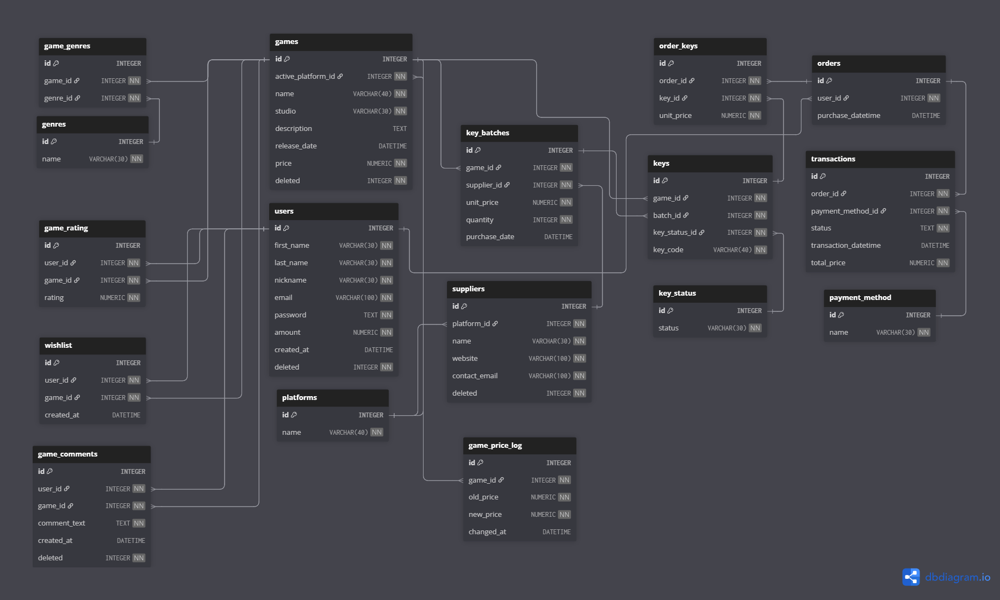

# Design Document

By Paulo Alexandre Mendes Campos

Video overview: <URL HERE>

## Scope

The database supports an online store for buying and reselling digital game keys, managing users, inventory, and payments while enabling efficient data queries for business insights.

Included in the database's scope is:

* **Users** — Stores player information and account details.
* **Genres** — Lists all available game genres.
* **Platforms** — Contains information about gaming platforms (e.g., Steam, PlayStation).
* **Games** — Stores main details about each game (title, studio, price, etc.).
* **Game_genres** — Links games to their genres (many-to-many relationship).
* **Wishlist** — Tracks games that users added to their wishlist.
* **Game_comments** — Stores user comments and reviews for each game.
* **Game_rating** — Contains the rating (0–10) given by users to games.
* **Game_price_log** — Records any price changes of games over time.
* **Key_status** — Defines possible statuses for game keys (Available, Sold, Refunded…).
* **Suppliers** — Stores information about key suppliers and their platforms.
* **Key_batches** — Represents batches of game keys purchased from suppliers.
* **Keys** — Contains individual activation keys linked to batches and games.
* **Orders** — Stores orders placed by users.
* **Order_keys** — Links specific game keys to user orders.
* **Payment_method** — Lists available payment methods (Credit Card, PayPal, etc.).
* **Transactions** — Records payment transactions related to each order.

### Outside scope
* Physical products or inventory tracking
* Key activation tracking
* Gift purchases
* Users accounts in platforms

## Functional Requirements
* Customers can view game information (such as price, genre, and platform), add games to a wishlist, purchase digital keys, leave comments, and rate games they have played.
* Customers cannot request refunds manually.

## Representation

### Entities

**Users**

<ul>
<li> <code>"id"</code> indicates the identification number. For this reason <code>INTEGER</code>. Every user must have a unique identity <code>PRIMARY KEY</code>. ID number will be added automatically <code>AUTOINCREMENT</code>. </li>
<li> <code>"first_name"</code> indicates the user's first name. Should not exceed 30 characters <code>VARCHAR(30)</code>. This line cannot be empty <code>NOT NULL</code>. </li>
<li> <code>"last_name"</code> indicates the user's last name. Should not exceed 30 characters <code>VARCHAR(30)</code>. This line cannot be empty <code>NOT NULL</code>. </li>
<li> <code>"nickname"</code> represents the user's nickname. Should not exceed 30 characters <code>VARCHAR(30)</code>. Must be unique <code>UNIQUE</code>. This line cannot be empty <code>NOT NULL</code>. </li>
<li> <code>"email"</code> represents the email address. Since it can contain special characters, the type is <code>VARCHAR(100)</code>. Must be unique <code>UNIQUE</code>. This line cannot be empty <code>NOT NULL</code>.Must have @ <code>CHECK("email" LIKE '%@%')</code> </li>
<li> <code>"password"</code> represents the user's password. Since it can contain various characters, the type is <code>TEXT</code>. This line cannot be empty <code>NOT NULL</code>. </li>
<li> <code>"amount"</code> indicates the balance available in the user’s account. The type is <code>NUMERIC</code>. Cannot be empty <code>NOT NULL</code>. Default value is <code>0</code> (<code>DEFAULT 0</code>).amount should not be negative <code>CHECK("amount" >= 0)</code>. </li>
<li> <code>"created_at"</code> indicates the date and time of registration. The type is <code>DATETIME</code>. It automatically gets the current timestamp <code>DEFAULT CURRENT_TIMESTAMP</code>. </li>
<li> <code>"deleted"</code> shows whether the user is active or deleted. The type is <code>INTEGER</code>. Cannot be empty <code>NOT NULL</code>. Default value is <code>0</code>. It can only be 0 or 1 <code>CHECK("deleted" IN (0,1))</code>. </li>
</ul>

**Genres**

<ul>
<li> <code>"id"</code> indicates the identification number. For this reason <code>INTEGER</code>. Every genre must have a unique identity <code>PRIMARY KEY</code>. ID number will be added automatically <code>AUTOINCREMENT</code>. </li>
<li> <code>"name"</code> indicates the genre name. Should not exceed 30 characters <code>VARCHAR(30)</code>. This line cannot be empty <code>NOT NULL</code>.Must be unique <code>UNIQUE</code>. </li>
</ul>

**Platforms**

<ul>
<li> <code>"id"</code> indicates the identification number. For this reason <code>INTEGER</code>. Every platform must have a unique identity <code>PRIMARY KEY</code>. ID number will be added automatically <code>AUTOINCREMENT</code>. </li>
<li> <code>"name"</code> indicates the platform name. Should not exceed 30 characters <code>VARCHAR(40)</code>. This line cannot be empty <code>NOT NULL</code>.Must be unique <code>UNIQUE</code>. </li>
</ul>

**Games**

<ul>
<li> <code>"id"</code> indicates the identification number. For this reason <code>INTEGER</code>. Every game must be unique <code>PRIMARY KEY</code>. The ID is added automatically <code>AUTOINCREMENT</code>. </li>
<li> <code>"active_platform_id"</code> indicates on which platform the game can be redeemed and activated. The type is <code>INTEGER</code>. This line cannot be empty <code>NOT NULL</code>. The <code>FOREIGN KEY</code> constraint is applied to the <code>'id'</code> column of the <code>'platforms'</code> table. </li>
<li> <code>"name"</code> represents the game title. Should not exceed 40 characters <code>VARCHAR(40)</code>. Must be unique <code>UNIQUE</code> and cannot be empty <code>NOT NULL</code>. </li>
<li> <code>"studio"</code> represents the name of the development studio. Should not exceed 30 characters <code>VARCHAR(30)</code>. Cannot be empty <code>NOT NULL</code>. </li>
<li> <code>"description"</code> indicates the game description. Because it can be long, it is <code>TEXT</code>. </li>
<li> <code>"release_date"</code> indicates the release date of the game. The type is <code>DATETIME</code>. </li>
<li> <code>"price"</code> indicates the game price. For this reason <code>NUMERIC</code>. Should not be empty <code>NOT NULL</code>. Price should not be negative <code>CHECK("price" >= 0)</code>. </li>
<li> <code>"deleted"</code> indicates if the game is deleted from the store. The type is <code>INTEGER</code>. Cannot be empty <code>NOT NULL</code>. Default value is <code>0</code>. Only 0 or 1 are allowed <code>CHECK("deleted" IN (0,1))</code>. </li>
</ul>

**Game_genres**
<ul>
<li> <code>"id"</code> indicates the identification number. For this reason <code>INTEGER</code>. Each relationship must be unique <code>PRIMARY KEY</code>. The ID is automatically generated <code>AUTOINCREMENT</code>. </li>
<li> <code>"game_id"</code> indicates which game this genre relationship belongs to. The type is <code>INTEGER</code>. Should not be empty <code>NOT NULL</code>. The <code>FOREIGN KEY</code> constraint references the <code>'id'</code> column of the <code>'games'</code> table. </li>
<li> <code>"genre_id"</code> indicates which genre is associated with the game. The type is <code>INTEGER</code>. Should not be empty <code>NOT NULL</code>. The <code>FOREIGN KEY</code> constraint references the <code>'id'</code> column of the <code>'genres'</code> table. </li>
<li> The combination of <code>"game_id"</code> and <code>"genre_id"</code> must be unique to avoid duplicate genre assignments for the same game <code>UNIQUE("game_id","genre_id")</code>. </li>
</ul>

**Wishlist**
<ul>
<li> <code>"id"</code> indicates the identification number. For this reason <code>INTEGER</code>. Each wishlist entry must be unique <code>PRIMARY KEY</code>. The ID is automatically generated <code>AUTOINCREMENT</code>. </li>
<li> <code>"user_id"</code> indicates which user added the game to their wishlist. The type is <code>INTEGER</code>. Should not be empty <code>NOT NULL</code>. The <code>FOREIGN KEY</code> constraint references the <code>'id'</code> column of the <code>'users'</code> table. </li>
<li> <code>"game_id"</code> indicates which game was added to the wishlist. The type is <code>INTEGER</code>. Should not be empty <code>NOT NULL</code>. The <code>FOREIGN KEY</code> constraint references the <code>'id'</code> column of the <code>'games'</code> table. </li>
<li> <code>"created_at"</code> indicates when the game was added to the wishlist. The type is <code>DATETIME</code>. It automatically gets the current timestamp <code>DEFAULT CURRENT_TIMESTAMP</code>. </li>
<li> The combination of <code>"user_id"</code> and <code>"game_id"</code> must be unique to prevent the same user from adding the same game multiple times to their wishlist <code>UNIQUE("user_id","game_id")</code>. </li>
</ul>

**Game_comments**
<ul>
<li> <code>"id"</code> indicates the identification number. For this reason <code>INTEGER</code>. Each comment must be unique <code>PRIMARY KEY</code>. The ID is automatically generated <code>AUTOINCREMENT</code>. </li>
<li> <code>"user_id"</code> indicates which user made the comment. The type is <code>INTEGER</code>. Should not be empty <code>NOT NULL</code>. The <code>FOREIGN KEY</code> constraint references the <code>'id'</code> column of the <code>'users'</code> table. </li>
<li> <code>"game_id"</code> indicates which game received the comment. The type is <code>INTEGER</code>. Should not be empty <code>NOT NULL</code>. The <code>FOREIGN KEY</code> constraint references the <code>'id'</code> column of the <code>'games'</code> table. </li>
<li> <code>"comment_text"</code> contains the actual comment content. The type is <code>TEXT</code> to accommodate comments of varying lengths. Cannot be empty <code>NOT NULL</code>. </li>
<li> <code>"created_at"</code> indicates when the comment was posted. The type is <code>DATETIME</code>. It automatically gets the current timestamp <code>DEFAULT CURRENT_TIMESTAMP</code>. </li>
<li> <code>"deleted"</code> indicates whether the comment has been deleted. The type is <code>INTEGER</code>. Cannot be empty <code>NOT NULL</code>. Default value is <code>0</code>. Only 0 or 1 are allowed <code>CHECK("deleted" IN (0,1))</code>. </li>
</ul>

**Game_rating**
<ul>
<li> <code>"id"</code> indicates the identification number. For this reason <code>INTEGER</code>. Each rating must be unique <code>PRIMARY KEY</code>. The ID is automatically generated <code>AUTOINCREMENT</code>. </li>
<li> <code>"user_id"</code> indicates which user gave the rating. The type is <code>INTEGER</code>. Should not be empty <code>NOT NULL</code>. The <code>FOREIGN KEY</code> constraint references the <code>'id'</code> column of the <code>'users'</code> table. </li>
<li> <code>"game_id"</code> indicates which game received the rating. The type is <code>INTEGER</code>. Should not be empty <code>NOT NULL</code>. The <code>FOREIGN KEY</code> constraint references the <code>'id'</code> column of the <code>'games'</code> table. </li>
<li> <code>"rating"</code> represents the numerical score given by the user. The type is <code>NUMERIC</code>. Cannot be empty <code>NOT NULL</code>. Must be between 0 and 10 inclusive <code>CHECK("rating" >= 0 AND "rating" <= 10)</code>. </li>
<li> The combination of <code>"user_id"</code> and <code>"game_id"</code> must be unique to prevent the same user from rating the same game multiple times <code>UNIQUE("user_id","game_id")</code>. </li>
</ul>

**Game_price_log**
<ul>
<li> <code>"id"</code> indicates the identification number. For this reason <code>INTEGER</code>. Each price change record must be unique <code>PRIMARY KEY</code>. The ID is automatically generated <code>AUTOINCREMENT</code>. </li>
<li> <code>"game_id"</code> indicates which game had its price changed. The type is <code>INTEGER</code>. Should not be empty <code>NOT NULL</code>. The <code>FOREIGN KEY</code> constraint references the <code>'id'</code> column of the <code>'games'</code> table. </li>
<li> <code>"old_price"</code> indicates the previous price of the game. The type is <code>NUMERIC</code>. Cannot be empty <code>NOT NULL</code>. </li>
<li> <code>"new_price"</code> indicates the new price of the game. The type is <code>NUMERIC</code>. Cannot be empty <code>NOT NULL</code>. </li>
<li> <code>"changed_at"</code> indicates when the price change occurred. The type is <code>DATETIME</code>. Cannot be empty <code>NOT NULL</code>. It automatically gets the current timestamp <code>DEFAULT CURRENT_TIMESTAMP</code>. </li>
</ul>

**Key_status**

<ul>
<li> <code>"id"</code> indicates the identification number. For this reason <code>INTEGER</code>. Each status must be unique <code>PRIMARY KEY</code>. The ID is automatically generated <code>AUTOINCREMENT</code>. </li>
<li> <code>"status"</code> indicates the name of the key status (Available, Sold, Refunded). Should not exceed 30 characters <code>VARCHAR(30)</code>. Cannot be empty <code>NOT NULL</code>. Must be unique <code>UNIQUE</code>. </li>
</ul>

**Suppliers**
<ul>
<li> <code>"id"</code> indicates the identification number. For this reason <code>INTEGER</code>. Each supplier must be unique <code>PRIMARY KEY</code>. Id is automatically incremented <code>AUTOINCREMENT</code>. </li>
<li> <code>"platform_id"</code> indicates which platform the supplier supports. The type is <code>INTEGER</code>. Should not be empty <code>NOT NULL</code>. The <code>FOREIGN KEY</code> constraint references the <code>'id'</code> in the <code>'platforms'</code> table. </li>
<li> <code>"name"</code> indicates the supplier name. Should not exceed 30 characters <code>VARCHAR(30)</code>. Should not be empty <code>NOT NULL</code>. Must be unique <code>UNIQUE</code>. </li>
<li> <code>"website"</code> indicates the supplier website. Should not exceed 100 characters <code>VARCHAR(100)</code>. Should not be empty <code>NOT NULL</code>. </li>
<li> <code>"contact_email"</code> represents the supplier’s contact email. Should not exceed 100 characters <code>VARCHAR(100)</code>. Should not be empty <code>NOT NULL</code>.Must have @ <code>CHECK("contact_email" LIKE '%@%')</code></li>
<li> <code>"deleted"</code> indicates whether the supplier is deleted. The type is <code>INTEGER</code>. Cannot be empty <code>NOT NULL</code>. Default value is <code>0</code>. Only 0 or 1 are valid <code>CHECK("deleted" IN (0,1))</code>. </li>
</ul>

**key_batches**

<ul>
<li> <code>"id"</code> indicates the identification number. For this reason <code>INTEGER</code>. Each batch must be unique <code>PRIMARY KEY</code>. The ID is automatically generated <code>AUTOINCREMENT</code>. </li>
<li> <code>"game_id"</code> indicates which game this batch of keys belongs to. The type is <code>INTEGER</code>. Should not be empty <code>NOT NULL</code>. The <code>FOREIGN KEY</code> constraint references the <code>'id'</code> column of the <code>'games'</code> table. </li>
<li> <code>"supplier_id"</code> indicates which supplier provided this batch. The type is <code>INTEGER</code>. Should not be empty <code>NOT NULL</code>. The <code>FOREIGN KEY</code> constraint references the <code>'id'</code> column of the <code>'suppliers'</code> table. </li>
<li> <code>"unit_price"</code> indicates the cost per key in this batch. The type is <code>NUMERIC</code>. Cannot be empty <code>NOT NULL</code>. </li>
<li> <code>"quantity"</code> indicates how many keys were purchased in this batch. The type is <code>INTEGER</code>. Cannot be empty <code>NOT NULL</code>. </li>
<li> <code>"purchase_date"</code> indicates when this batch was purchased. The type is <code>DATETIME</code>. It automatically gets the current timestamp <code>DEFAULT CURRENT_TIMESTAMP</code>. </li>
</ul>

**Keys**

<ul>
<li> <code>"id"</code> indicates the identification number. For this reason <code>INTEGER</code>. Each key must be unique <code>PRIMARY KEY</code>. The ID is automatically generated <code>AUTOINCREMENT</code>. </li>
<li> <code>"game_id"</code> indicates which game this key belongs to. The type is <code>INTEGER</code>. Should not be empty <code>NOT NULL</code>. The <code>FOREIGN KEY</code> constraint references the <code>'id'</code> column of the <code>'games'</code> table. </li>
<li> <code>"batch_id"</code> indicates from which batch this key was purchased. The type is <code>INTEGER</code>. Should not be empty <code>NOT NULL</code>. The <code>FOREIGN KEY</code> constraint references the <code>'id'</code> column of the <code>'key_batches'</code> table. </li>
<li> <code>"key_status_id"</code> indicates the current status of the key (Available, Sold, Refunded). The type is <code>INTEGER</code>. Should not be empty <code>NOT NULL</code>. The <code>FOREIGN KEY</code> constraint references the <code>'id'</code> column in the <code>'key_status'</code> table. </li>
<li> <code>"key_code"</code> represents the actual game key code. Should not exceed 40 characters <code>VARCHAR(40)</code>. Must be unique <code>UNIQUE</code> and cannot be empty <code>NOT NULL</code>. </li>
</ul>

**Orders**

<ul>
<li> <code>"id"</code> indicates the identification number. For this reason <code>INTEGER</code>. Each order must be unique <code>PRIMARY KEY</code>. Id should be auto incrementing <code>AUTOINCREMENT</code>. </li>
<li> <code>"user_id"</code> indicates which customer placed the order. For this reason <code>INTEGER</code>. Cannot be empty <code>NOT NULL</code>. The <code>FOREIGN KEY</code> constraint references the <code>'id'</code> column in the <code>'users'</code> table. </li>
<li> <code>"purchase_datetime"</code> represents the date and time when the purchase was made. The type is <code>DATETIME</code>. It automatically gets the current timestamp <code>DEFAULT CURRENT_TIMESTAMP</code>. </li>
</ul>

**Order_keys**
<ul>
<li> <code>"id"</code> indicates the identification number. For this reason <code>INTEGER</code>. Each order-key relationship must be unique <code>PRIMARY KEY</code>. The ID is automatically generated <code>AUTOINCREMENT</code>. </li>
<li> <code>"order_id"</code> indicates which order this key belongs to. The type is <code>INTEGER</code>. Should not be empty <code>NOT NULL</code>. The <code>FOREIGN KEY</code> constraint references the <code>'id'</code> column of the <code>'orders'</code> table. </li>
<li> <code>"key_id"</code> indicates which specific key was sold in this order. The type is <code>INTEGER</code>. Should not be empty <code>NOT NULL</code>. The <code>FOREIGN KEY</code> constraint references the <code>'id'</code> column of the <code>'keys'</code> table. </li>
<li> <code>"unit_price"</code> indicates the price at which the key was sold. The type is <code>NUMERIC</code>. Cannot be empty <code>NOT NULL</code>. </li>
</ul>

**Payment_method**
<ul>
<li> <code>"id"</code> indicates the identification number. For this reason <code>INTEGER</code>. Each payment method must be unique <code>PRIMARY KEY</code>. The ID is automatically generated <code>AUTOINCREMENT</code>. </li>
<li> <code>"name"</code> indicates the name of the payment method (Credit Card, PayPal, etc.). Should not exceed 30 characters <code>VARCHAR(30)</code>. Cannot be empty <code>NOT NULL</code>. </li>
</ul>

**Transactions**

<ul>
<li> <code>"id"</code> indicates the transaction identification number. For this reason <code>INTEGER</code>. Each transaction must be unique <code>PRIMARY KEY</code>. Id is automatically incremented <code>AUTOINCREMENT</code>. </li>
<li> <code>"order_id"</code> indicates which order this transaction belongs to. The type is <code>INTEGER</code>. Should not be empty <code>NOT NULL</code>. The <code>FOREIGN KEY</code> constraint references the <code>'id'</code> in the <code>'orders'</code> table. </li>
<li> <code>"payment_method_id"</code> indicates which payment method was used. The type is <code>INTEGER</code>. Cannot be empty <code>NOT NULL</code>. The <code>FOREIGN KEY</code> constraint references the <code>'id'</code> column in the <code>'payment_method'</code> table. </li>
<li> <code>"status"</code> indicates the current status of the transaction (Sold, Refunded, Cancelled, Failed). The type is <code>TEXT</code>. Cannot be empty <code>NOT NULL</code>. Default value is <code>'Sold'</code>. Limited options with <code>CHECK("status" IN ('Sold', 'Refunded', 'Cancelled', 'Failed'))</code>. </li>
<li> <code>"transaction_datetime"</code> indicates the time when the transaction occurred. The type is <code>DATETIME</code>. Automatically receives the current timestamp <code>DEFAULT CURRENT_TIMESTAMP</code>. </li>
<li> <code>"total_price"</code> indicates the total amount of the transaction. The type is <code>NUMERIC</code>. Cannot be empty <code>NOT NULL</code>. Value must be greater than or equal to zero. <code>CHECK("total_price" >= 0)</code>. </li>
</ul>

### Relationships

### Diagram

**As detailed by the diagram:**
<ul>
<li> There can be more than one wishlist entry for a user, but the same wishlist entry cannot represent more than one user. (one-to-many relationship)</li>
<li> There can be more than one comment by a user, but the same comment cannot represent more than one user. (one-to-many relationship)</li>
<li> There can be more than one rating by a user, but the same rating cannot represent more than one user. (one-to-many relationship)</li>
<li> There can be more than one order for a user, but the same order cannot represent more than one user. (one-to-many relationship)</li>
<li> There can be more than one wishlist entry for a game, but the same wishlist entry cannot represent more than one game. (one-to-many relationship)</li>
<li> There can be more than one comment for a game, but the same comment cannot represent more than one game. (one-to-many relationship)</li>
<li> There can be more than one rating for a game, but the same rating cannot represent more than one game. (one-to-many relationship)</li>
<li> There can be more than one price log entry for a game, but the same price log entry cannot represent more than one game. (one-to-many relationship)</li>
<li> There can be more than one key batch for a game, but the same key batch cannot represent more than one game. (one-to-many relationship)</li>
<li> There can be more than one game for a genre, and one game can have more than one genre. (many-to-many relationship)</li>
<li> There can be more than one game for a platform, but the same game cannot have more than one active platform. (one-to-many relationship)</li>
<li> There can be more than one supplier for a platform, but the same supplier cannot represent more than one platform. (one-to-many relationship)</li>
<li> There can be more than one key for a key status, but the same key cannot have more than one key status. (one-to-many relationship)</li>
<li> There can be more than one key batch from a supplier, but the same key batch cannot represent more than one supplier. (one-to-many relationship)</li>
<li> There can be more than one key in a key batch, but the same key cannot be in more than one key batch. (one-to-many relationship)</li>
<li> There can be more than one order_keys entry for an order, but the same order_keys entry cannot represent more than one order. (one-to-many relationship)</li>
<li> The key has an order_keys entry, and the same order_keys entry represents one key. (one-to-one relationship)</li>
<li> There can be more than one transaction for an order, but the same transaction cannot represent more than one order. (one-to-many relationship)</li>
<li> There can be more than one transaction for a payment method, but the same transaction cannot represent more than one payment method. (one-to-many relationship)</li>
</ul>

## Optimizations

**Views**
<ul>
<li><code>"available_keys_per_game"</code> Shows the number of available keys for each game to manage inventory.</li>
<li><code>"keys_per_game"</code> Shows the total number of keys for each game regardless of status.</li>
<li><code>"games_rank_rating"</code> Shows games ranked by their average user rating.</li>
<li><code>"keys_by_supplier"</code> Shows the total keys and batches purchased from each supplier.</li>
<li><code>"most_sold_games"</code> Shows the most sold games based on key sales.</li>
<li><code>"user_essential_data"</code> Shows user information without sensitive data like passwords.</li>
<li><code>"revenue_per_game"</code> Shows the total revenue generated by each game.</li>
<li><code>"cost_per_game"</code> Shows the total cost invested in each game.</li>
<li><code>"profit_per_game"</code> Shows the profit calculated as revenue minus cost for each game.</li>
<li><code>"keys_bought_user"</code> Links purchased keys to users with game and purchase details.</li>
</ul>

**Index**
<ul>
<li><code>"idx_orders_user_id"</code> To speed up searches for orders by user.</li>
<li><code>"idx_keys_game_id"</code> To optimize queries filtering keys by game.</li>
<li><code>"idx_keys_status_id"</code> To improve performance when filtering keys by status.</li>
<li><code>"idx_rating_user_id"</code> To accelerate queries finding user ratings.</li>
<li><code>"idx_rating_game_id"</code> To optimize searches for game ratings.</li>
<li><code>"idx_order_key_id"</code> To improve performance when linking orders to keys.</li>
<li><code>"idx_order_keys_order_id"</code> To speed up order key lookups by order.</li>
<li><code>"idx_transactions_order_id"</code> To optimize transaction searches by order.</li>
<li><code>"idx_game_comments"</code> To speed up searches for user comments on games.</li>
</ul>

**Triggers**
<ul>
<li><code>"del_game"</code> Implements soft delete for games instead of physical deletion.</li>
<li><code>"del_user"</code> Implements soft delete for users instead of physical deletion.</li>
<li><code>"del_game_comments"</code> Implements soft delete for game comments instead of physical deletion.</li>
<li><code>"del_suppliers"</code> Implements soft delete for suppliers instead of physical deletion.</li>
<li><code>"remov_from_wishlist"</code> Automatically removes games from user's wishlist after purchase.</li>
<li><code>"sold_status"</code> Updates key status to 'Sold' when transaction is completed.</li>
<li><code>"log_price_change"</code> Logs all price changes for games in the price history table.</li>
<li><code>"update_key_status_refunded"</code> Updates key status to 'Refunded' when transaction is refunded.</li>
<li><code>"validate_key_availability"</code> Ensures only available keys can be added to orders.</li>
<li><code>"update_user_amount_refund"</code> Refunds user's balance when a transaction is refunded.</li>
<li><code>"validate_key_batch_game_insert"</code> Validates that keys match the game ID of their batch.</li>
<li><code>"prevent_double_keys_on_order"</code> Prevents the same key from being added multiple times to an order.</li>
<li><code>"validate_wallet_payment"</code> Validates user has sufficient balance for wallet payments.</li>
<li><code>"deduct_wallet_payment"</code> Deducts amount from user's wallet when using wallet payment.</li>
<li><code>"validate_active_user_purchase"</code> Ensures that the purchasing user is active.</li>
<li><code>"validate_active_game_sale"</code> Ensures that the purchased game is active.</li>
</ul>

## Limitations
<ul>
<li>Limited Key Status History — The system only records the current key status, without tracking historical changes.</li>
<li>Simplified Pricing Model — Prices are stored as a single fixed value per game, with no discount or regional pricing support.</li>
<li>Platform-Based Price Variations Not Supported — Each game can have only one active platform and no per-platform price differentiation.</li>
<li>Supplier Details Limited — Supplier data is basic and does not include contract terms or delivery details.</li>
</ul>
